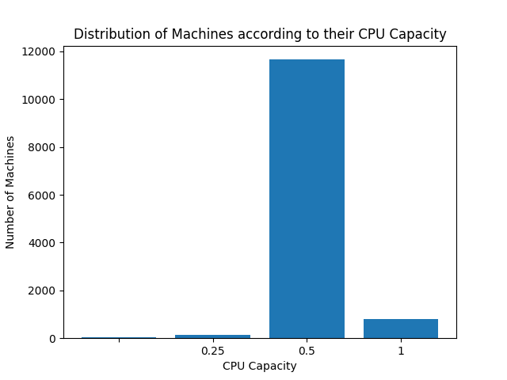
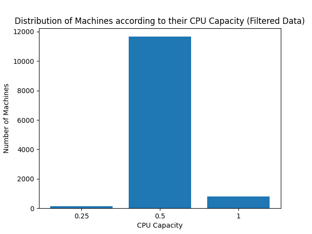
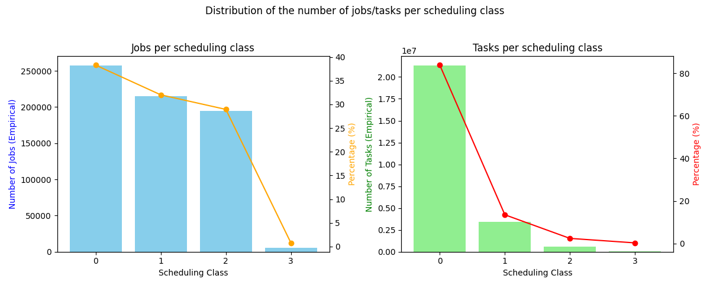

# Spark Project M2 MOSIG

## How to run the project
We assume that you have already installed Spark and that you have a working version of Python 3.10 or higher.
to run all the questions of the project, you need to run the following commands **in the root directory of the project**:
```bash
    python3 ./src/main.py
```
If you want to run with a filter on the missing values, you can run the following command:
```bash
    python3 ./src/main.py filtered
```
If you want to run a specific question, you can run the following command:
```bash
    python3 ./src/main.py <questions_number>
```
where `<questions_number>` are the number of the questions you want to run (1, 2, etc. separated by a space).
And you can obviously add the `filtered` argument and mix the arguments.

Example:
```bash
    python3 ./src/main.py 1 2 filtered
```

## Description of the data

### machine_events
There is only one file in the `machine_events` directory. This file contains the following columns:

| Column | Title           | Type        | Mandatory | Description                                                                                   |
|--------|-----------------|-------------|-----------|-----------------------------------------------------------------------------------------------|
| 1      | Timestamp       | INTEGER     | YES       | Temps de l'événement en microsecondes depuis 600 secondes avant le début de la trace.         |
| 2      | Machine ID      | INTEGER     | YES       | Identifiant unique de la machine impliquée dans l'événement.                                  |
| 3      | Event Type      | INTEGER     | YES       | Type d'événement : <br>0: ADD (ajout) <br>1: REMOVE (suppression) <br>2: UPDATE (mise à jour) |
| 4      | Platform ID     | STRING_HASH | NO        | Identifiant haché de la plateforme, correspondant à la microarchitecture et au chipset.       |
| 5      | CPU Capacity    | FLOAT       | NO        | Capacité normalisée du CPU de la machine (1.0 représente la capacité maximale).               |
| 6      | Memory Capacity | FLOAT       | NO        | Capacité normalisée de la mémoire de la machine (1.0 représente la capacité maximale).        |

### job_events
There are 500 files in the `job_events` directory. Each file contains the following columns:

| Column | Title            | Type        | Mandatory | Description                                                                                                                                                       |
|--------|------------------|-------------|-----------|-------------------------------------------------------------------------------------------------------------------------------------------------------------------|
| 1      | Timestamp        | INTEGER     | YES       | Temps de l'événement en microsecondes depuis 600 secondes avant le début de la trace.                                                                             |
| 2      | Missing Info     | INTEGER     | YES       | Indique si certaines informations sont manquantes dans l'événement : <br>0: non manquant <br>1                                                                    |
| 3      | Job ID           | INTEGER     | YES       | Identifiant unique de l'emploi impliqué dans l'événement.                                                                                                         |
| 4      | Event Type       | INTEGER     | YES       | Type d'événement : <br>0: SUBMIT (soumission) <br>1: SCHEDULE (planification) <br>2: EVICT (éviction) <br>3: FAIL (échec) <br>4: FINISH (fin) <br>5: KILL (arrêt) |
| 5      | User             | STRING_HASH | NO        | Identifiant haché de l'utilisateur qui a soumis l'emploi.                                                                                                         |
| 6      | Scheduling Class | INTEGER     | NO        | Classe de planification de l'emploi : <br>0: non défini <br>1: normale <br>2: best effort <br>3: background                                                       |
| 7      | Job Name         | STRING_HASH | NO        | Nom de l'emploi.                                                                                                                                                  |
| 8      | Logical Job Name | STRING_HASH | NO        | Nom logique de l'emploi.                                                                                                                                          |

### task_events
There are 500 files in the `task_events` directory. Each file contains the following columns:

| Column | Title             | Type        | Mandatory | Description                                                                                                                                                       |
|--------|-------------------|-------------|-----------|-------------------------------------------------------------------------------------------------------------------------------------------------------------------|
| 1      | Timestamp         | INTEGER     | YES       | Temps de l'événement en microsecondes depuis 600 secondes avant le début de la trace.                                                                             |
| 2      | Missing Info      | INTEGER     | YES       | Indique si certaines informations sont manquantes dans l'événement : <br>0: non manquant <br>1                                                                    |
| 3      | Job ID            | INTEGER     | YES       | Identifiant unique de l'emploi impliqué dans l'événement.                                                                                                         |
| 4      | Task Index        | INTEGER     | YES       | Index de la tâche dans l'emploi.                                                                                                                                  |
| 5      | Machine ID        | INTEGER     | YES       | Identifiant unique de la machine impliquée dans l'événement.                                                                                                      |
| 6      | Event Type        | INTEGER     | YES       | Type d'événement : <br>0: SUBMIT (soumission) <br>1: SCHEDULE (planification) <br>2: EVICT (éviction) <br>3: FAIL (échec) <br>4: FINISH (fin) <br>5: KILL (arrêt) |
| 7      | User              | STRING_HASH | NO        | Identifiant haché de l'utilisateur qui a soumis l'emploi.                                                                                                         |
| 8      | Scheduling Class  | INTEGER     | NO        | Classe de planification de la tâche : <br>0: non défini <br>1: normale <br>2: best effort <br>3: background                                                       |
| 9      | Priority          | INTEGER     | NO        | Priorité de la tâche.                                                                                                                                             |
| 10     | CPU Request       | FLOAT       | NO        | Nombre de cœurs de CPU demandés par la tâche.                                                                                                                     |
| 11     | Memory Request    | FLOAT       | NO        | Quantité de mémoire demandée par la tâche.                                                                                                                        |
| 12     | Disk Request      | FLOAT       | NO        | Quantité de disque demandée par la tâche.                                                                                                                         |
| 13     | Different Machine | INTEGER     | NO        | Indique si la tâche doit être exécutée sur une machine différente de celle où elle a été soumise : <br>0: non <br>1: oui                                          |

## Description of the analyses

We say here that we consider both filtered and unfiltered data. This is why we have two different histograms for the first question for example.

### Question 1 : What is the distribution of the machines according to their CPU capacity?
For this question we started by mapping the data as a key-value pair where the key the machine id and the value is 1.
We then reduced the data by summing the values for each key. This way we can count the number of machines.
We then print the number of machines.

After that, we mapped the data as a key-value pair where the key is the machine id and the value is the cpu capacity.
We suppressed the duplicates pairs by using the `distinct` function.
Then we mapped the data as a key-value pair where the key is the cpu capacity and the value is 1 for each machine.
We then reduced the data by summing the values for each key. This way we can count the number of machines for each cpu capacity.

We then print the distribution of the CPU capacity of the machines.
To fully answer this question, we plot the distribution of the CPU capacity with a histogram.

### Question 2 : What is the percentage of computational power lost due to maintenance?
For this question we started by filter the data to keep only the rows where event type is 0 or 1. This way we keep only the rows where the machine is added or removed.

We then mapped the data as a key-value pair where the key is the machine id and the value is the tuple (timestamp, event type, cpu capacity (if the cpu capacity is empty, we put 0)).
We grouped the data by key and sorted the values by timestamp. This way we can have the events in the right order for each machine.
After that, we mapped the data the function `compute_lost_power` which will compute the lost power for each machine as follows:

- If the first event is an ADD event, we create checkpoints with the timestamp to calculate time intervals. 
- If the first event is a REMOVE event, we create the checkpoint at 0 to calculate time intervals. 
- For each event, we calculate the time interval between a REMOVE event and the next ADD event. It represents the time the machine is down.
Because we had the time when the machine was added, we can be sure that the machine restarted (which is the criteria on the paper to consider that it is a maintenance).
- We then calculate the downtime as the sum of the time intervals.
- We also calculate the total time as the difference between the last timestamp and the first timestamp.
- Then we return the downtime the total time and the cpu capacity of the machine.

Finally, we compute the total power lost and the total power by mapping the data as a pair of (downtime\*cpucapacity, total time\*cpucapacity) then we reduce the data by summing the values two by two.
It gives us the total power lost and the total power.
We then print the percentage of computational power lost due to maintenance.

### Question 3 : What is the distribution of the jobs/tasks per scheduling class?
First, we did two different functions to compute the distribution of the jobs and tasks per scheduling class.
The only difference between the two functions is on the way of isolate the jobs and tasks.
For the jobs, we filter the data with the job name and for the tasks, we filter the data with the job id associated with the task_index.

Why did we do that?
- Because we have the possibility to have a job restart with another job id but the same job name.

Well, now we clarify that we'll describe the job function with annotation for the task function.

- We map the data as a key-value pair where the key is the job name (or the job id + task index) and the value is scheduling class.
- We suppress the duplicates pairs by using the `distinct` function.
- We count to keep the number of jobs (tasks) per scheduling class.
- We compute the repartition of the jobs (tasks) per scheduling class by mapping the data as a key-value pair where the key is the scheduling class and the value is 1.
- We reduce the data by summing the values for each key. This way we can count the number of jobs (tasks) per scheduling class.
- We then print the distribution of the jobs (tasks) per scheduling class.

To fully answer this question, we plot the distribution of the jobs and tasks per scheduling class with two histograms.
We also plot the percentage of the jobs and tasks per scheduling class with curves.

### Question 4 : Do tasks with a low scheduling class have a higher probability of being evicted?
For this question :
1. We started by filtering the data to keep on one hand low scheduling class tasks and on the other hand other tasks.
2. We save the number of low scheduling class tasks and the number of other tasks.
3. We then filter the data to keep only the evicted tasks in the two groups.
4. We save the number of evicted low scheduling class tasks and the number of evicted other tasks.
5. We then compute the probability of being evicted for low scheduling class tasks and other tasks.
6. Finally, we print the probability of being evicted for low scheduling class tasks and other tasks.

## Results

### Question 1
- The distribution of the CPU capacity of the machines is shown in the following histogram:


- The distribution of the CPU capacity of the machines (filtered) is shown in the following histogram:



### Question 2
The percentage of computational power lost due to maintenance is 2.19%.

#### Please note that: It is not logic to filter for this question because we need to consider all the add and remove events to calculate the downtime and the missing values are appearing in add events.

**To have a complete version of it:** We need to reconsider the definition of maintenance time.
We need to define a specific case when a machine has an add event with no cpu capacity then an update event and after a remove event.

#### Examples:
- Should we (or not) take the time between the add event and the update event as maintenance time?
- Should we calculate the power of the machine with 0 (or future) cpu capacity between the add event and the update event?
- Should we ignore the execution if the machine has no cpu capacity at the add event?
- ...

### Question 3
The distribution of the jobs and tasks per scheduling class is shown in the following histogram:


**Note that :**
- The bars are the empirical distribution of the jobs and tasks per scheduling class.
- The curve is the percentage of the jobs and tasks per scheduling class.
- Points are linked only because it is easier to read the curve than only points. We know that scheduling class is an integer and not a continuous variable.

### Question 4
The probability of being evicted for low scheduling class tasks is 4.16% against 2.86% for other tasks.
So, tasks with a low scheduling class have a higher probability of being evicted.

### Author:
- Romain Alves
- Sylvain Joubert
