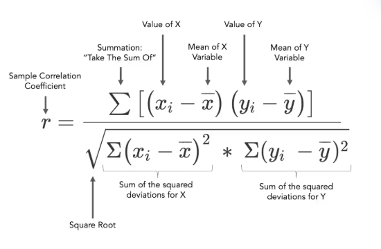
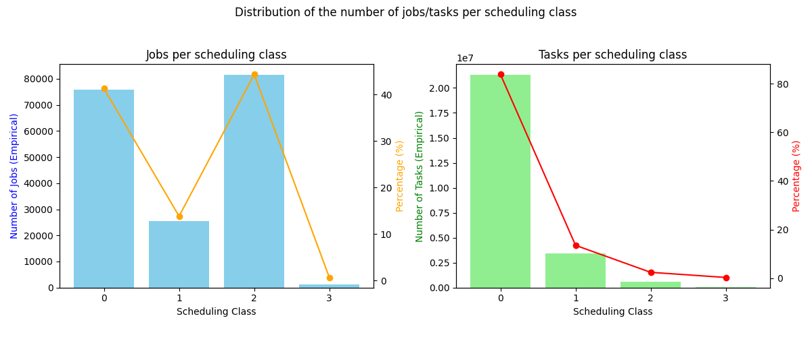
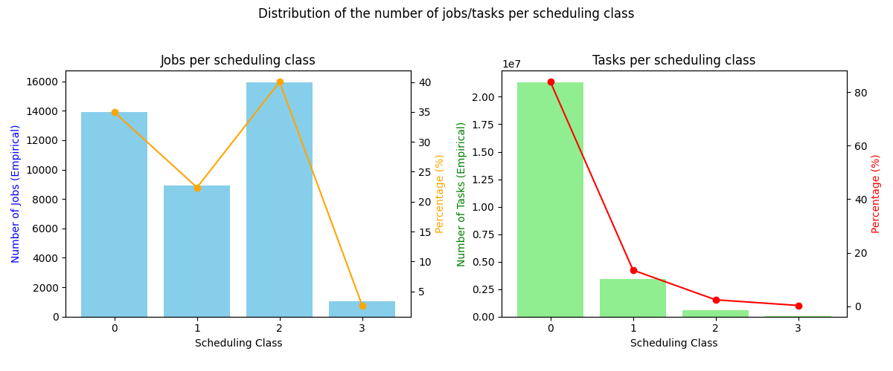

# Spark Project M2 MOSIG

## How to run the project
To download the dataset, you need to run the following command **in the root directory of the project**:
```bash
    gsutil -m cp gs://clusterdata-2011-2/machine_events/ ./data/
    gsutil -m cp gs://clusterdata-2011-2/job_events/ ./data/
    gsutil -m cp gs://clusterdata-2011-2/task_events/ ./data/
    gsutil -m cp gs://clusterdata-2011-2/task_usage/ ./data/
```
This will download the dataset in the `data` directory. To un compress the files, you need to run the following command **in the root directory of the project**:
```bash
    gunzip ./data/machine_events/*
    gunzip ./data/job_events/*
    gunzip ./data/task_events/*
    gunzip ./data/task_usage/*
```

We assume that you have already installed Spark, matplotlib and that you have a working version of Python 3.10 or higher.
to run all the questions of the project, you need to run the following commands **in the root directory of the project**:
```bash
    python3 ./src/main.py
```
**It is possible for you to have issues with a "librairy src not found" :** To resolve it just uncomment the line 7 in the file `src/main.py` and run again the same way as before.

If you want to run with more annotation and more information, you can run the following command:
```bash
    python3 ./src/main.py check
```
If you want to run a specific question, you can run the following command:
```bash
    python3 ./src/main.py <questions_number>
```
where `<questions_number>` are the number of the questions you want to run (1, 2, etc. separated by a space).

And you can obviously add the `check` argument and mix the arguments.

Example:
```bash
    python3 ./src/main.py 1 2 check
```

## Description of the data

### machine_events
There is only one file in the `machine_events` directory. This file contains the following columns:

| Column | Title           | Type        | Mandatory |
|--------|-----------------|-------------|-----------|
| 1      | Timestamp       | INTEGER     | YES       |
| 2      | Machine ID      | INTEGER     | YES       |
| 3      | Event Type      | INTEGER     | YES       |
| 4      | Platform ID     | STRING_HASH | NO        |
| 5      | CPU Capacity    | FLOAT       | NO        |
| 6      | Memory Capacity | FLOAT       | NO        |

### job_events
There are 500 files in the `job_events` directory. Each file contains the following columns:

| Column | Title            | Type        | Mandatory |
|--------|------------------|-------------|-----------|
| 1      | Timestamp        | INTEGER     | YES       |
| 2      | Missing Info     | INTEGER     | YES       |
| 3      | Job ID           | INTEGER     | YES       |
| 4      | Event Type       | INTEGER     | YES       |
| 5      | User             | STRING_HASH | NO        |
| 6      | Scheduling Class | INTEGER     | NO        |
| 7      | Job Name         | STRING_HASH | NO        |
| 8      | Logical Job Name | STRING_HASH | NO        |

### task_events
There are 500 files in the `task_events` directory. Each file contains the following columns:

| Column | Title             | Type        | Mandatory |
|--------|-------------------|-------------|-----------|
| 1      | Timestamp         | INTEGER     | YES       |
| 2      | Missing Info      | INTEGER     | YES       |
| 3      | Job ID            | INTEGER     | YES       |
| 4      | Task Index        | INTEGER     | YES       |
| 5      | Machine ID        | INTEGER     | YES       |
| 6      | Event Type        | INTEGER     | YES       |
| 7      | User              | STRING_HASH | NO        |
| 8      | Scheduling Class  | INTEGER     | NO        |
| 9      | Priority          | INTEGER     | NO        |
| 10     | CPU Request       | FLOAT       | NO        |
| 11     | Memory Request    | FLOAT       | NO        |
| 12     | Disk Request      | FLOAT       | NO        |
| 13     | Different Machine | INTEGER     | NO        |

### task_usage
There are 500 files in the `task_usage` directory. Each file contains the following columns:

| Column | Title                         | Type    | Mandatory |
|--------|-------------------------------|---------|-----------|
| 1      | Start Time                    | INTEGER | YES       |
| 2      | End Time                      | INTEGER | YES       |
| 3      | Job ID                        | INTEGER | YES       |
| 4      | Task Index                    | INTEGER | YES       |
| 5      | Machine ID                    | INTEGER | YES       |
| 6      | CPU Rate                      | FLOAT   | NO        |
| 7      | Canonical Memory              | FLOAT   | NO        |
| 8      | Assigned Memory               | FLOAT   | NO        |
| 9      | Unmapped Page Cache           | FLOAT   | NO        |
| 10     | Total Page Cache              | FLOAT   | NO        |
| 11     | Maximum Memory                | FLOAT   | NO        |
| 12     | Disk I/O Time                 | FLOAT   | NO        |
| 13     | Local Disk Space              | FLOAT   | NO        |
| 14     | Maximum CPU Rate              | FLOAT   | NO        |
| 15     | Maximum Disk IO Time          | FLOAT   | NO        |
| 16     | Cycle Per Instruction         | FLOAT   | NO        |
| 17     | Memory Access Per Instruction | FLOAT   | NO        |
| 18     | Sample Portion                | FLOAT   | NO        |
| 19     | Aggregation Type              | BOOL    | NO        |
| 20     | Sampled CPU Usage             | FLOAT   | NO        |

## Description of the analyses

### Question 1 : What is the distribution of the machines according to their CPU capacity?
For this question we started by mapping the data as a key-value pair where the key the machine id and the value is 1.
We then reduced the data by summing the values for each key. This way we can count the number of machines.
We then print the number of machines.

After that, we mapped the data as a key-value pair where the key is the machine id and the value is the cpu capacity.
We suppressed the duplicates pairs by using the `distinct` function.
Then we mapped the data as a key-value pair where the key is the cpu capacity and the value is 1 for each machine.
We then reduced the data by summing the values for each key. This way we can count the number of machines for each cpu capacity.

We then print the distribution of the CPU capacity of the machines.
To fully answer this question, we plot the distribution of the CPU capacity with a histogram.

### Question 2 : What is the percentage of computational power lost due to maintenance?
For this question we started by filter the data to keep only the rows where event type is 0 or 1. This way we keep only the rows where the machine is added or removed.

We then mapped the data as a key-value pair where the key is the machine id and the value is the tuple (timestamp, event type, cpu capacity (if the cpu capacity is empty, we put 0)).
We grouped the data by key and sorted the values by timestamp. This way we can have the events in the right order for each machine.
After that, we mapped the data the function `compute_lost_power` which will compute the lost power for each machine as follows:

- If the first event is an ADD event, we create checkpoints with the timestamp to calculate time intervals. 
- If the first event is a REMOVE event, we create the checkpoint at 0 to calculate time intervals. 
- For each event, we calculate the time interval between a REMOVE event and the next ADD event. It represents the time the machine is down.
Because we had the time when the machine was added, we can be sure that the machine restarted (which is the criteria on the paper to consider that it is a maintenance).
- We then calculate the downtime as the sum of the time intervals.
- We also calculate the total time as the difference between the last timestamp and the first timestamp.
- Then we return the downtime the total time and the cpu capacity of the machine.

Finally, we compute the total power lost and the total power by mapping the data as a pair of (downtime\*cpucapacity, total time\*cpucapacity) then we reduce the data by summing the values two by two.
It gives us the total power lost and the total power.
We then print the percentage of computational power lost due to maintenance.

### Question 3 : What is the distribution of the jobs/tasks per scheduling class?
First, we did two different functions to compute the distribution of the jobs and tasks per scheduling class.
The only difference between the two functions is on the way of isolate the jobs and tasks.
For the jobs, we filter the data with the (job name, logical job name or jobID you can find the tree result below) and for the tasks, we filter the data with the job id associated with the task_index.

Why did we do that?
- Because we have the possibility to have a job restart with another job id but the same job name, and we do not understand the logical job name usage.

Well, now we clarify that we'll describe the job function with annotation for the task function.

- We map the data as a key-value pair where the key is the job name (or the job id + task index) and the value is scheduling class.
- We suppress the duplicates pairs by using the `distinct` function.
- We count to keep the number of jobs (tasks) per scheduling class.
- We compute the repartition of the jobs (tasks) per scheduling class by mapping the data as a key-value pair where the key is the scheduling class and the value is 1.
- We reduce the data by summing the values for each key. This way we can count the number of jobs (tasks) per scheduling class.
- We then print the distribution of the jobs (tasks) per scheduling class.

To fully answer this question, we plot the distribution of the jobs and tasks per scheduling class with two histograms.
We also plot the percentage of the jobs and tasks per scheduling class with curves.

### Question 4 : Do tasks with a low scheduling class have a higher probability of being evicted?
For this question :
1. We started by filtering the data to keep on one hand low scheduling class tasks and on the other hand other tasks.
2. We save the number of low scheduling class tasks and the number of other tasks.
3. We then filter the data to keep only the evicted tasks in the two groups.
4. We save the number of evicted low scheduling class tasks and the number of evicted other tasks.
5. We then compute the probability of being evicted for low scheduling class tasks and other tasks.
6. Finally, we print the probability of being evicted for low scheduling class tasks and other tasks.

### Question 5 : In general, do tasks from the same job run on the same machine?
First, we want to fix the meaning behind "In general" that we are going to use for this question. 
We choose to give a threshold, here 65%, were if there is more than *threshold* jobs that run on the same machine we can answer the question affirmatively. We can modify *threshold* in the code.
    
On task_events, after removing the missing data : 
- We make a key-value pair (jobID, machineID)
- We remove the duplicates, meaning we keep only one instance when a jobID is on the same machine several times 
- We group the values by keys, i.e. by jobID. The result is that each job is associated with a 'list' of different machines.
- We count the length of the machines for each job. If the length is greater than one, then tasks from this job don't run on all on the same machine. 
- Finally, we count the number of jobs that satisfy this property, and we give our answer. 

### Question 6 : Are the tasks that request the more resources the one that consume the more resources?
For this question, we had a lot of trouble.
- The dataset is HUGE, and we can't load it all in memory.
- We tried to use the `sample` function to reduce the size of the dataset, but it was not enough.
- We also tried to use the `take` function to take only a few rows, but it was not enough either.

So, after 2 days trying to solve the question on our computer,
We moved the project on Google cloud platform to create a VM with 64GB of RAM.
We never use it before so we had to learn, and it takes us a lot of time to understand how to use it (a full day).

We leaned in our M1 Info Data Base course to filter as much and as soon as possible the data before starting the computation to reduce the size of the dataset. Which implies that we reduce the time of computation.
- So we filtered the data of the first table to keep only the rows :
  - JobID, Task Index, CPU Request, Memory Request, Disk Request and with the CPU Request, Memory Request, Disk Request not empty.
- We then filtered the data of the second table to keep only the rows :
  - JobID, Task Index, CPU Max, Memory Max, Disk Max also with the CPU Max, Memory Max, Disk Max not empty.
- We then mapped the data as a key-value pair :
  - Where the key is the (JobID, Task Index)
  - The value is the tuple (CPU Request, Memory Request, Disk Request)
  - Same for the second table with the CPU Max, Memory Max, Disk Max
- After that, we reduced the data from the two tables to keep only the maximum of the values for each key.
  - We do that because we want to compare the maximum of the request with the maximum of the usage. To know at what point the request is in adequacy with the maximum usage.
- We then joined the two tables on the key (JobID, Task Index).
- We then mapped the data as pairs of (CPU Request, CPU Max), (Memory Request, Memory Max), (Disk Request, Disk Max).
- For each pair, : we compute the correlation between the two values.



- Finally, we print the correlation (in percentage) between the CPU Request and the CPU Max, the Memory Request and the Memory Max, the Disk Request and the Disk Max.
- 
#### How to interpret the correlation?
- The correlation coefficient r is a unitless value between -1 and 1.
- The closer r is to zero, the weaker the linear relationship.
- Positive values of r indicate a positive correlation when the values of the two variables tend to increase together.
- Negative values of r indicate a negative correlation when the values of one variable tend to increase and the values of the other variable decrease.
- The values 1 and -1 each represent ‘perfect’ correlations, positive and negative respectively. Two variables with a perfect correlation move together at a fixed speed. The relationship is said to be linear; plotted in a scatter plot, all the data points can be connected by a straight line.

### Custom 1 : Wich machine has the the highest/lowest ratio failure/task?

First, we talk about the task executed by the machine.
- We filter the data to keep only the rows where the machineID, the jobID, and the task index are not empty.
  - We then map the data as key (MachineID, JobID, Task Index) and value 1.
  - We distinct to have only one instance of each task executed by the machine.
  - We then count the number of tasks executed by each machine.

After that, we talk about the failure of the machine.
- We reuse the data filtered before.
  - We filter the data to keep only the rows where the event type is 2.
  - We then map the data as key (MachineID, JobID, Task Index) and value 1.
  - We then reduce the data by summing the values for each key. This way we can count the number of failures for each machine.
  - We then join the two tables on the key (MachineID, JobID, Task Index). Precisely we did a left outer join to keep all the tasks executed and add the failure count.
  - We then fill the missing values with 0.
  - We then map the data to transform the failure count into a failure ratio

We sort the data by the failure ratio and we print the machine with the highest and the lowest ratio failure/task.

Finally, we compute the ratio failure/task for each machine and we print the machine with the highest and the lowest ratio failure/task.
- 

## Results

### Question 1
- The distribution of the CPU capacity of the machines is shown in the following histogram:


### Question 2
The percentage of computational power lost due to maintenance is 2.19%.

#### Please note that: It is not logic to filter for this question because we need to consider all the add and remove events to calculate the downtime and the missing values are appearing in add events.

**To have a complete version of it:** We need to reconsider the definition of maintenance time.
We need to define a specific case when a machine has an add event with no cpu capacity then an update event and after a remove event.

#### Examples:
- Should we (or not) take the time between the add event and the update event as maintenance time?
- Should we calculate the power of the machine with 0 (or future) cpu capacity between the add event and the update event?
- Should we ignore the execution if the machine has no cpu capacity at the add event?
- ...

### Question 3
The distribution of the jobs and tasks per scheduling class is shown in the following histogram:

With jobs selected by the jobID :


With jobs selected by the job name :



With jobs selected by the logical job name :



**Note that :**
- The bars are the empirical distribution of the jobs and tasks per scheduling class.
- The curve is the percentage of the jobs and tasks per scheduling class.
- Points are linked only because it is easier to read the curve than only points. We know that scheduling class is an integer and not a continuous variable.
- For each version we always have some jobs and tasks with more than one scheduling class (and none of them are empty).
  - For the jobID version, we have 3 jobs with more than one scheduling class.
  - For the job name version, we have 30 jobs with more than one scheduling class.
  - For the logical job name version, we have 50 jobs with more than one scheduling class.
  - For the task version, we have 3 tasks with more than one scheduling class. 
  - *You can check that by using the `check` parameter and changing the selection in the code* 

### Question 4
The probability of being evicted for low scheduling class tasks is 4.16% against 2.86% for other tasks.
So, tasks with a low scheduling class have a higher probability of being evicted.


### Question 5 
With a threshold of 65%, we can affirm that tasks from the same job run on the same machine in general.

| Where it run      | Percentage    |
|-------------------|---------------|
| Same Machine      | 73.34 %       |
| Different Machine | 26.66 %       |

### Question 6
With a threshold of 80%, we can affirm that tasks that request the more resources are not always the one that consumes the more resources.

We can notice that there is a small positive correlation between the request and the maximum usage for the memory. But for the CPU and the Disk, there is no clear positive correlation.

We obtained the following correlation between the request and the maximum usage:

| Data   | Correlation en % |
|--------|------------------|
| CPU    | 22.68            |
| Memory | 60.28            |
| Disk   | 1.65             |

### Custom 1
We obtain a surprising result for the machine with the highest ratio failure/task.
- The machine with the highest ratio failure/task is the machine with the machineID 1436489701 with a ratio of 2.676.
  - We can see that as a machine who restarted some tasks because it's not possible to have more failures than tasks.
  - An upgrade point can be to determine the number of tasks that have been restarted by the machine. Or the total number of tasks that have started + restarted to have the real ratio.
- The machine with the lowest ratio failure/task is the machine with the machineID 1436491597 with a ratio of 0.000.
  - We can see a lot of machines with a ratio of 0.000. It means that they have no failure in the filtered data that we used.

#### Here the top 5 of the highest ratio failure/task :
1. 1436489701 : 2.67647
2. 317330964 : 0.95699
3. 4246147567 : 0.8826
4. 288814348 : 0.76471
5. 5068065359 : 0.75

## Table of the execution time
| Question       | 1    | 2    | 3              | 4                  | 5              | 6                  | Custom 1         | Custom 2 | Total      |
|----------------|------|------|----------------|--------------------|----------------|--------------------|------------------|----------|------------|
| Execution time | 0s   | 0s   | 49s ( < 1min ) | 73s ( < 1min 30s ) | 43s ( < 1min ) | 10336s ( ~ 3h )    | 89s (~ 1min 30s) |          | ~ 3h 10min |


## Problems encountered
- The dataset is HUGE, and we can't load it all in memory. (2 days of work to decide to move the project on Google cloud platform)
- Google cloud platform is not easy to use when you never used it before. (1 day of work to understand how to use it)
  - To be honest we had :
    - Problem to understand how to access to the service because there is so many random message everywhere.
    - Problem to understand that we need to create a VM to use the service. And not install the project on the session.
    - Problem of disk space because it is 40GB when it is compressed and 200GB when it is uncompressed. So i uninstall the project and reinstall it on a bigger disk added manually (4 hours).
    - Problem Google cloud is so slow to download and uncompress the dataset. (6 hours)
    - Problem to reconnect to the VM : when I write these lines, I am trying to reconnect to the VM for 2 hours. I just wanted to be sure that I've download clusterdata-2011-2 and not clusterdata-2011-1.
      - So the result of the Q6 is maybe not the good one because I can't check it.

### Author:
- Romain Alves
- Sylvain Joubert
